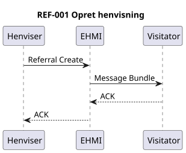
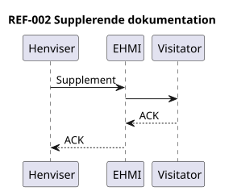
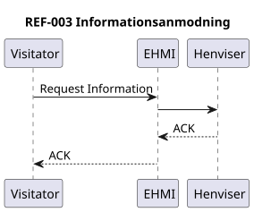
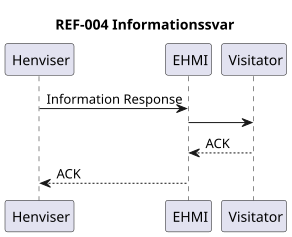
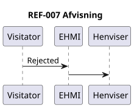
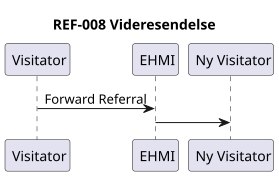
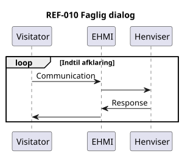
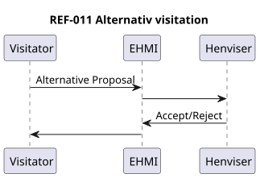
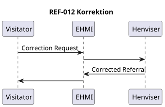

# Fhir Henvisning Messaging Cgpt - DK MEDCOM REFERRAL LM v0.1.0

* [**Table of Contents**](toc.md)
* **Fhir Henvisning Messaging Cgpt**

## Fhir Henvisning Messaging Cgpt

## FHIR Messaging for Henvisningshåndtering

Dette dokument beskriver en FHIR Messaging-baseret model for henvisningshåndtering.

### REF-001 – Opret henvisning

  

**Beskrivelse**

Henviser -> EHMI : REF-001 EHMI -> Visitator

### REF-002 – Supplerende dokumentation

  

**Beskrivelse**

Henviser -> EHMI : REF-002 EHMI -> Visitator

### REF-003 – Anmodning om supplerende oplysninger

  

**Beskrivelse**

Visitator -> EHMI : REF-003 EHMI -> Henviser

### REF-004 – Besvarelse af anmodning

  

**Beskrivelse**

Henviser -> EHMI : REF-004 EHMI -> Visitator

### REF-005 – Accept af henvisning

Accept af henvisning

**Beskrivelse**

Visitator -> EHMI : REF-005 EHMI -> Henviser

### REF-006 – Booking gennemført

Booking gennemført

**Beskrivelse**

Visitator -> EHMI : REF-006 EHMI -> Henviser

### REF-007 – Afvisning

  

**Beskrivelse**

Visitator -> EHMI : REF-007 EHMI -> Henviser

### REF-008 – Videresendelse

  

**Beskrivelse**

Visitator -> EHMI : REF-008 EHMI -> Ny Visitator

### REF-009 – Statusopdatering

  

**Beskrivelse**

Visitator -> EHMI : REF-009 EHMI -> Henviser

### REF-010 – Faglig dialog

  

**Beskrivelse**

Visitator <-> Henviser via EHMI

### REF-011 – Alternativ visitation

  

**Beskrivelse**

Visitator <-> Henviser via EHMI

### REF-012 – Korrektion

  

**Beskrivelse**

Visitator -> Henviser -> Visitator via EHMI

