# Fhir Henvisning Use Cases Claude 2 - DK MEDCOM REFERRAL LM v0.1.0

* [**Table of Contents**](toc.md)
* **Fhir Henvisning Use Cases Claude 2**

## Fhir Henvisning Use Cases Claude 2

# User stories for FHIR-baseret henvisningshåndtering

Oversigten beskriver user stories for de to primære roller i et FHIR-baseret henvisningsflow:

> 
**henviser** (den der afsender en henvisning) 
**Visitator** (den der modtager og triagerer).

Derudover beskrives user stories der kun opstår i den fælles udvekslingsdialog mellem de to parter. Al kommunikation foregår via FHIR-baserede meddelelser.

## User story oversigt med FHIR ressource

| | | |
| :--- | :--- | :--- |
| Oprette henvisning | ServiceRequest | Henviser → Visitator |
| Tilknytte dokumentation | DiagnosticReport, Media, DocumentReference | Henviser → Visitator |
| Ændre henvisning | ServiceRequest (revision) | Henviser → Visitator |
| Tilbagekalde henvisning | ServiceRequest (revoked) | Henviser → Visitator |
| Monitorere status | Subscription, SubscriptionStatus | Begge |
| Modtage afgørelse | Task, SubscriptionNotification | Visitator → Henviser |
| Modtage og kvittere | Bundle, MessageHeader | Visitator (intern) |
| Triagere og prioritere | Task | Visitator (intern) |
| Acceptere og booke | ServiceRequest, Appointment | Visitator → Henviser |
| Afvise henvisning | Task, ServiceRequest | Visitator → Henviser |
| Videresende | ServiceRequest (replaces) | Visitator → Ny modtager (Ny Visitator) |
| Ændre prioritet | ServiceRequest, SubscriptionNotification | Visitator → Henviser |
| Anmode om supplement | CommunicationRequest | Visitator → Henviser |
| Besvare supplement | Communication | Henviser → Visitator |
| Faglig afklaring | Communication (thread) | Begge |
| Statusnotifikation | SubscriptionNotification | Visitator → Henviser |
| Alternativ visitation | Communication, Task | Begge |
| Korrektionsaftale | Communication, ServiceRequest | Begge |

**Diagrammer:**

> 
- Hver user storie refererer til et tilhørende PlantUML-diagram i filen `fhir-henvisning-use-cases-claude2.puml`. 
- Filen indeholder 18 `@startuml`-blokke — én per user storie — og kan renderes enkeltvis via PlantUML-CLI (`-p <diagram-id>`) eller i editorer med PlantUML-understøttelse (VS Code, IntelliJ, Confluence o.l.). 
- Diagrammerne kan også gengives samlet ved at ekskludere `!include`-direktiverne og blot åbne `.puml`-filen direkte.

-------

## Henviserens user stories

Disse user stories udføres selvstændigt af henviseren uden at kræve aktiv respons fra visitatoren ud over systemkvittering.

### User story 1.1 Oprette en ny henvisning

> **User story:** Som henviser ønsker jeg at kunne oprette og afsende en struktureret henvisning via FHIR, 
når jeg har truffet en klinisk beslutning om at viderehenvise en patient, 
så visitatoren modtager alle nødvendige oplysninger på et standardiseret format.

 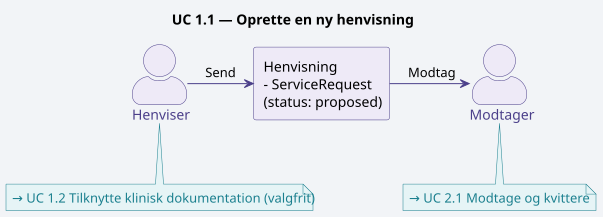 

| |
| :--- |
| Henviseren udfærdiger og afsender en ny henvisning til et modtagende tilbud. Henvisningen repræsenteres som en`ServiceRequest`-ressource med status`proposed`og sendes i en FHIR-`Bundle`. Henvisningen indeholder patientoplysninger, indikation, hastegrad og ønsket ydelse. |

| | |
| :--- | :--- |
| **Primær FHIR-ressource:** | `ServiceRequest` |
| **Triggerhændelse:** | Klinisk beslutning om at henvise patient |
| **Næste trin:** | →[1.2 Tilknytte klinisk dokumentation](#12-tilknytte-klinisk-dokumentation)**(hvis supplerende materiale er relevant)**·→[2.1 Modtage og kvittere for ny henvisning](#21-modtage-og-kvittere-for-ny-henvisning)**(visitatorsiden modtager)** |

### User story 1.2 Tilknytte klinisk dokumentation

> **User story:** Som henviser ønsker jeg at kunne vedhæfte relevant klinisk dokumentation til en eksisterende henvisning, 
når jeg vurderer at visitatoren har brug for supplerende materiale for at træffe en god afgørelse, 
så beslutningsgrundlaget er samlet ét sted.

 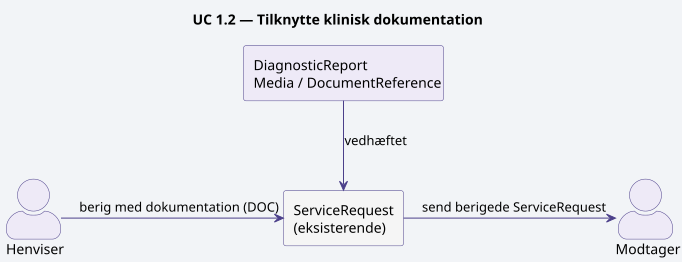 

| |
| :--- |
| Henviseren vedhæfter supplerende klinisk materiale til en eksisterende henvisning — fx laboratoriesvar, billeddiagnostik eller tidligere epikriser. Materialet knyttes til`ServiceRequest`-ressourcen via referencer til`DiagnosticReport`,`Media`eller`DocumentReference`. |

| | |
| :--- | :--- |
| **Primær FHIR-ressource:** | `DiagnosticReport`,`Media`,`DocumentReference` |
| **Triggerhændelse:** | Behov for at understøtte klinisk beslutningsgrundlag |
| **Næste trin:** | →[2.1 Modtage og kvittere for ny henvisning](#21-modtage-og-kvittere-for-ny-henvisning)**(visitatoren modtager den berigede henvisning)** |

### User story 1.3 Ændre en afsendt henvisning

> **User story:** Som henviser ønsker jeg at kunne rette indholdet i en allerede afsendt henvisning, 
når jeg opdager en fejl eller patientens kliniske situation ændrer sig, 
så visitatoren altid arbejder ud fra korrekte og aktuelle oplysninger.

 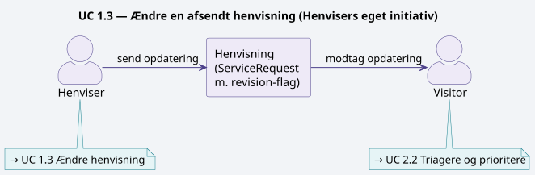 

Henviseren opdaterer indholdet af en allerede afsendt henvisning — fx korrigerer indikation, hastegrad eller kontaktoplysninger. Opdateringen sker via en opdatering på den eksisterende `ServiceRequest`, og der sættes et revisionsflag så visitatoren notificeres om ændringen.

| | |
| :--- | :--- |
| **Primær FHIR-ressource:** | `ServiceRequest`(revision) |
| **Triggerhændelse:** | Fejl opdaget eller klinisk situation ændret efter afsendelse |
| **Næste trin:** | →[2.2 Triagere og prioritere en henvisning](#22-triagere-og-prioritere-en-henvisning)**(visitatoren modtager ændringsnotifikation og reviagerer)** |

### User story 1.4 Tilbagekalde en henvisning

> **User story:** Som henviser ønsker jeg at kunne tilbagekalde en afsendt henvisning, 
når patienten ikke længere ønsker forløbet eller det kliniske grundlag er bortfaldet, 
så visitatoren ikke bruger ressourcer på en henvisning der ikke skal ekspederes.

 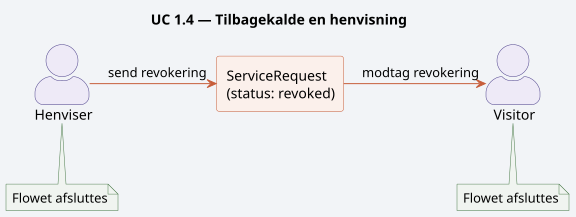 

Henviseren annullerer en afsendt henvisning, der endnu ikke er ekspederet. `ServiceRequest`-status sættes til `revoked` og en notifikation sendes til visitatoren.

| | | |
| :--- | :--- | :--- |
| **Primær FHIR-ressource:** | `ServiceRequest`(status = revoked) |   |
| **Triggerhændelse:** | Patienten ønsker ikke forløbet, eller klinisk grundlag er bortfaldet |   |
| **Næste trin:** | **(Flowet afsluttes — ingen yderligere behandling påkrævet)** |   |

### User story 1.5 Monitorere status på afsendte henvisninger

> **User story:** Som henviser ønsker jeg løbende at kunne se status på mine afsendte og udestående henvisninger, 
når jeg har behov for overblik over patienternes videre forløb, 
så jeg kan følge op og informere patienterne korrekt.

 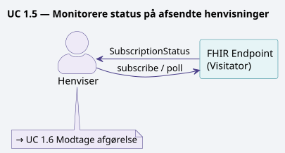 

Henviseren følger løbende op på status for egne udestående henvisninger. Dette kan ske via FHIR-subscription (push) eller ved periodisk polling mod visitatorens FHIR-endpoint.

| | |
| :--- | :--- |
| **Primær FHIR-ressource:** | `Subscription`,`SubscriptionStatus`,`ServiceRequest` |
| **Triggerhændelse:** | Behov for overblik over egne afsendte henvisninger |
| **Næste trin:** | →[1.6 Modtage afgørelse fra visitatoren](#16-modtage-afgørelse-fra-visitatoren)**(statusoverblikket leder til modtagelse af den endelige afgørelse)** |

### User story 1.6 Modtage afgørelse fra visitatoren

> **User story:** Som henviser ønsker jeg automatisk at modtage visitatorens afgørelse i mit journalsystem, 
når visitatoren har truffet beslutning om accept, afvisning eller alternativt tilbud, 
så jeg hurtigt kan handle og orientere patienten.

 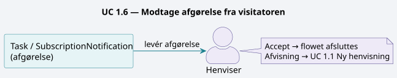 

Henviseren modtager visitatorens endelige afgørelse — accept, afvisning eller alternativt tilbud — og integrerer denne i eget journalsystem. Afgørelsen leveres som en `Task`-ressource eller notifikation med reference til den oprindelige `ServiceRequest`.

| | |
| :--- | :--- |
| **Primær FHIR-ressource:** | `Task`,`SubscriptionNotification` |
| **Triggerhændelse:** | Visitatoren har truffet afgørelse om henvisningen |
| **Næste trin:** | →[1.1 Oprette en ny henvisning](#11-oprette-en-ny-henvisning)**(hvis afgørelsen er en afvisning og patienten skal viderehenvisies)**·**(Flowet afsluttes ved accept)** |

## Visitatorens user stories

Disse user stories udføres selvstændigt af visitatoren som led i modtagelse og behandling af indkomne henvisninger.

### User story 2.1 Modtage og kvittere for ny henvisning

> **User story:** Som visitator ønsker jeg automatisk at modtage og kvittere for indkomne henvisninger via FHIR, 
når en ny `ServiceRequest` ankommer i mit endpoint, 
så afsenderen hurtigt får bekræftet at henvisningen er modtaget korrekt.

 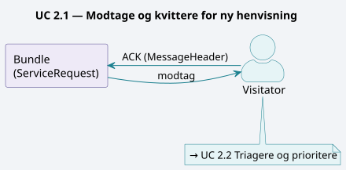 

Visitatoren modtager en indkommende FHIR-`Bundle` med en ny `ServiceRequest` og sender en teknisk kvittering (ACK) tilbage til afsendersystemet. Henvisningen registreres i visitationssystemet med status `active` eller `on-hold` afhængigt af triagekapacitet.

| | |
| :--- | :--- |
| **Primær FHIR-ressource:** | `Bundle`,`MessageHeader`,`ServiceRequest` |
| **Triggerhændelse:** | Indkommende henvisning i FHIR-endpoint |
| **Næste trin:** | →[2.2 Triagere og prioritere en henvisning](#22-triagere-og-prioritere-en-henvisning) |

### User story 2.2 Triagere og prioritere en henvisning

> **User story:** Som visitator ønsker jeg at kunne foretage en struktureret triage af en modtaget henvisning og dokumentere mit udfald, 
når en ny eller opdateret henvisning er klar til klinisk vurdering, 
så prioriteringen er sporbar og ensartet på tværs af alle indkomne sager.

 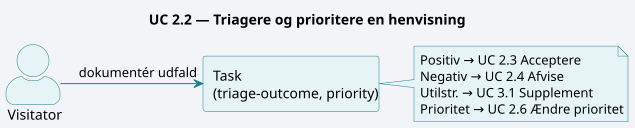 

Visitatoren vurderer henvisningens faglige indhold, klassificerer hastegrad og prioriterer i forhold til øvrige indkomne henvisninger. Triage-udfaldet dokumenteres i en `Task`-ressource med udfald og begrundelse.

| | |
| :--- | :--- |
| **Primær FHIR-ressource:** | `Task`(triage-outcome, priority) |
| **Triggerhændelse:** | Ny eller opdateret henvisning klar til klinisk vurdering |
| **Næste trin:** | →[2.3 Acceptere en henvisning og booke forløb](#23-acceptere-en-henvisning-og-booke-forløb)**(positiv afgørelse)**·→[2.4 Afvise en henvisning](#24-afvise-en-henvisning)**(negativ afgørelse)**·→[3.1 Anmode om supplerende oplysninger](#31-anmode-om-supplerende-oplysninger)**(grundlaget er utilstrækkeligt)**·→[2.6 Ændre prioritet](#26-ændre-prioritet-på-en-modtaget-henvisning)**(prioriteten justeres)** |

### User story 2.3 Acceptere en henvisning og booke forløb

> **User story:** Som visitator ønsker jeg at kunne acceptere en henvisning og oprette en booking, 
når min visitationsafgørelse er positiv, 
så patienten får en tid og henviseren automatisk modtager bekræftelsen.

 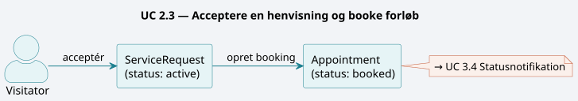 

Visitatoren accepterer henvisningen og opretter et forløb. Der bookes en tid, og `ServiceRequest`-status opdateres til `active`. En `Appointment`-ressource oprettes og linkes til henvisningen.

| | |
| :--- | :--- |
| **Primær FHIR-ressource:** | `ServiceRequest`(active),`Appointment`(booked) |
| **Triggerhændelse:** | Positiv visitationsafgørelse |
| **Næste trin:** | →[3.4 Statusnotifikation til henviser](#34-statusnotifikation-til-henviser)**(henviser notificeres om accept og booking)** |

### User story 2.4 Afvise en henvisning

> **User story:** Som visitator ønsker jeg at kunne afvise en henvisning med en dokumenteret begrundelse, 
når indikationen ikke er opfyldt eller kapaciteten er nået, 
så henviseren forstår årsagen og kan tage stilling til næste skridt for patienten.

 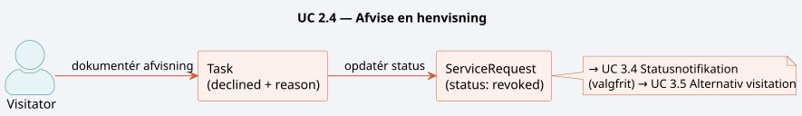 

Visitatoren afviser henvisningen med en faglig eller kapacitetsmæssig begrundelse. `ServiceRequest`-status sættes til `revoked` eller `completed` med en `Task`-ressource der angiver årsag til afvisning.

| | |
| :--- | :--- |
| **Primær FHIR-ressource:** | `Task`(declined + reason),`ServiceRequest` |
| **Triggerhændelse:** | Indikation ikke opfyldt, forkert visitationsspor, eller kapacitetsloft nået |
| **Næste trin:** | →[3.4 Statusnotifikation til henviser](#34-statusnotifikation-til-henviser)**(henviser notificeres om afvisning)**·→[3.5 Aftale om alternativ visitation](#35-aftale-om-alternativ-visitation)**(hvis alternativ løsning bør afsøges)** |

### User story 2.5 Videresende til anden modtager

> **User story:** Som visitator ønsker jeg at kunne videresende en fejlplaceret henvisning til rette modtager, 
når jeg vurderer at et andet tilbud er bedre egnet, 
så patienten ikke unødigt forsinkes og henviseren holdes orienteret om omdirigeringen.

 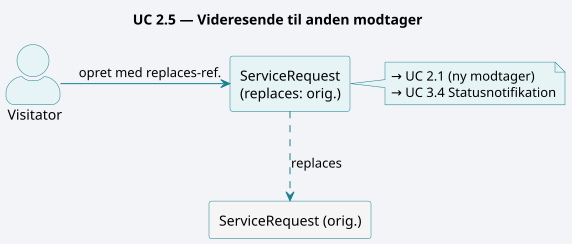 

Visitatoren vurderer at henvisningen hører hjemme et andet sted og videresender. Der oprettes en ny `ServiceRequest` med reference til den originale via `replaces`-attributten, og der sendes notifikation til den oprindelige henviser.

| | |
| :--- | :--- |
| **Primær FHIR-ressource:** | `ServiceRequest`(replaces),`Task`,`Communication` |
| **Triggerhændelse:** | Forkert modtager eller bedre egnet tilbud identificeret |
| **Næste trin:** | →[2.1 Modtage og kvittere for ny henvisning](#21-modtage-og-kvittere-for-ny-henvisning)**(ny modtager starter sit eget modtagelsesflow)**·→[3.4 Statusnotifikation til henviser](#34-statusnotifikation-til-henviser)**(den oprindelige henviser orienteres)** |

### User story 2.6 Ændre prioritet på en modtaget henvisning

> **User story:** Som visitator ønsker jeg at kunne justere prioriteten på en allerede modtaget henvisning, 
når ny klinisk information eller ændret kapacitetssituation tilsiger det, 
så den kliniske hastegrad afspejles korrekt og henviseren notificeres om ændringen.

 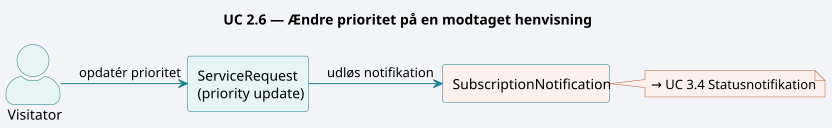 

Visitatoren revurderer hastegraden for en allerede modtaget henvisning — fx på baggrund af ny klinisk information eller ændret kapacitetssituation. Prioriteten opdateres på `ServiceRequest` og der sendes notifikation til henviseren.

| | |
| :--- | :--- |
| **Primær FHIR-ressource:** | `ServiceRequest`(priority update),`SubscriptionNotification` |
| **Triggerhændelse:** | Ny information ændrer klinisk hastegrad |
| **Næste trin:** | →[3.4 Statusnotifikation til henviser](#34-statusnotifikation-til-henviser)**(henviser notificeres om den ændrede prioritet)** |

## Udvekslingsdialog (fælles user stories)

Disse user stories forudsætter aktiv kommunikation frem og tilbage mellem henviser og visitator via FHIR-beskeder.

### User story 3.1 Anmode om supplerende oplysninger

> **User story:** Som visitator ønsker jeg at kunne sende en struktureret anmodning om supplerende oplysninger til henviseren, 
når grundlaget for triage er utilstrækkeligt, 
så jeg kan træffe en fagligt forsvarlig visitationsafgørelse uden at afvise unødigt.

 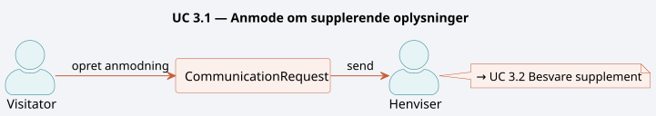 

Visitatoren mangler oplysninger for at kunne triagere og sender en struktureret anmodning til henviseren om at supplere med konkrete kliniske data — fx blodprøveresultater, BMI, medicinliste eller tidligere forløb.

| | |
| :--- | :--- |
| **Primær FHIR-ressource:** | `CommunicationRequest`(fra visitator til henviser) |
| **Triggerhændelse:** | Utilstrækkeligt grundlag for visitationsafgørelse |
| **Næste trin:** | →[3.2 Besvare anmodning om supplement](#32-besvare-anmodning-om-supplement) |

### User story 3.2 Besvare anmodning om supplement

> **User story:** Som henviser ønsker jeg at kunne besvare en supplement-anmodning med de efterspurgte kliniske oplysninger, 
når visitatoren har bedt om yderligere data, 
så visitatoren hurtigt kan genoptage og afslutte triage-processen.

 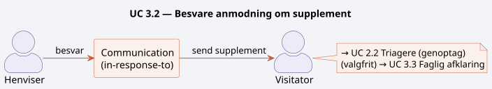 

Henviseren modtager en supplement-anmodning og besvarer denne ved at sende de efterspurgte oplysninger. Svaret sendes som en `Communication`-ressource med reference til den oprindelige `CommunicationRequest` og til `ServiceRequest`.

| | |
| :--- | :--- |
| **Primær FHIR-ressource:** | `Communication`(reply, in-response-to) |
| **Triggerhændelse:** | Modtagelse af CommunicationRequest fra visitatoren |
| **Næste trin:** | →[2.2 Triagere og prioritere en henvisning](#22-triagere-og-prioritere-en-henvisning)**(visitatoren genoptager triage med det modtagne supplement)**·→[3.3 Faglig afklaring i dialog](#33-faglig-afklaring-i-dialog)**(hvis svaret afføder yderligere spørgsmål)** |

### User story 3.3 Faglig afklaring i dialog

> **User story:** Som henviser og visitator ønsker vi begge at kunne føre en struktureret faglig dialog om en konkret henvisning, 
når indikation, egnethed eller behandlingsvalg er uklart, 
så vi i fællesskab kan nå frem til den rigtige afgørelse for patienten uden at skulle bruge andre kommunikationskanaler.

 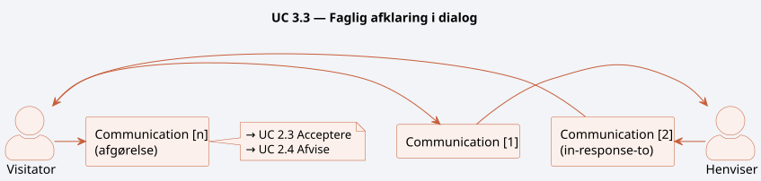 

Henviser og visitator udveksler kliniske spørgsmål og svar for at afklare indikation, behandlingsegnethed eller alternativ tilgang — uden at dette nødvendigvis afklares i én besked. Dialogen føres som en kæde af `Communication`-ressourcer med indbyrdes referencer.

| | |
| :--- | :--- |
| **Primær FHIR-ressource:** | `Communication`(thread med in-response-to-kæde) |
| **Triggerhændelse:** | Faglig uklarhed der kræver mere end én udveksling |
| **Næste trin:** | →[2.3 Acceptere en henvisning og booke forløb](#23-acceptere-en-henvisning-og-booke-forløb)**(afklaring munder ud i accept)**·→[2.4 Afvise en henvisning](#24-afvise-en-henvisning)**(afklaring munder ud i afvisning)** |

### User story 3.4 Statusnotifikation til henviser

> **User story:** Som henviser ønsker jeg automatisk at modtage en notifikation, 
når status på en af mine henvisninger ændrer sig hos visitatoren, 
så jeg til enhver tid er opdateret om forløbet uden at skulle forespørge aktivt.

 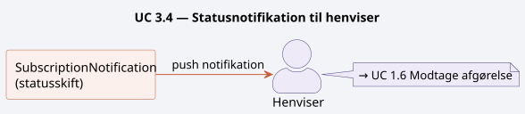 

Visitatoren notificerer automatisk henviseren ved statusskift på en afsendt henvisning — fx modtaget, under vurdering, accepteret eller afvist. Notifikationen leveres via FHIR-subscription og indeholder reference til den opdaterede `ServiceRequest`.

| | |
| :--- | :--- |
| **Primær FHIR-ressource:** | `SubscriptionNotification`,`ServiceRequest` |
| **Triggerhændelse:** | Ethvert statusskift på en aktiv henvisning hos visitatoren |
| **Næste trin:** | →[1.6 Modtage afgørelse fra visitatoren](#16-modtage-afgørelse-fra-visitatoren)**(notifikationen udløser håndtering af afgørelsen hos henviseren)** |

### User story 3.5 Aftale om alternativ visitation

> **User story:** Som visitator ønsker jeg at kunne indlede en dialog med henviseren om et alternativt tilbud, 
når jeg ikke kan imødekomme den primære henvisning, 
så patienten ikke ender i en blindgyde og vi i fællesskab finder en løsning.

 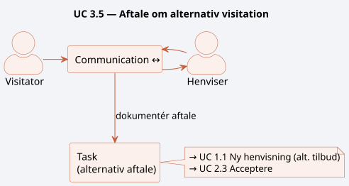 

Henviser og visitator forhandler i fællesskab om et alternativt tilbud, 
når det primære visitationsspor ikke er muligt. Dialogen foregår via `Communication`, og den resulterende aftale dokumenteres i en `Task` med reference til det alternative tilbud.

| | |
| :--- | :--- |
| **Primær FHIR-ressource:** | `Communication`,`Task`,`ServiceRequest`(alternativ) |
| **Triggerhændelse:** | Afvisning kombineret med behov for at finde alternativ løsning for patienten |
| **Næste trin:** | →[1.1 Oprette en ny henvisning](#11-oprette-en-ny-henvisning)**(nyt alternativt tilbud kræver ny henvisning)**·→[2.3 Acceptere en henvisning og booke forløb](#23-acceptere-en-henvisning-og-booke-forløb)**(alternativt tilbud accepteres)** |

### User story 3.6 Korrektionsaftale om fejl i afsendt henvisning

> **User story:** Som visitator ønsker jeg at kunne kontakte henviseren og aftale en korrektion, 
når jeg opdager en fejl i en modtaget henvisning, 
så fejlen rettes på en koordineret og sporbar måde uden at vi mister historikken.

 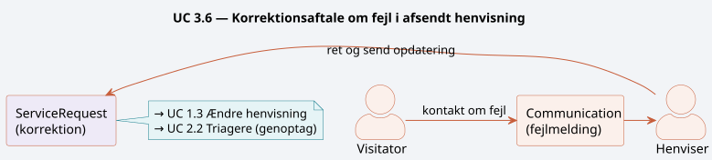 

Visitatoren opdager en fejl i en modtaget henvisning — fx forkert CPR-nummer, forkert ydelseskode eller manglende samtykkedokumentation — og indleder en dialog med henviseren om korrektion. Korrektionen aftales via `Communication`-besked og gennemføres med en efterfølgende opdatering af `ServiceRequest`.

| | |
| :--- | :--- |
| **Primær FHIR-ressource:** | `Communication`,`ServiceRequest`(korrektion) |
| **Triggerhændelse:** | Fejl opdaget under modtagelse eller triage hos visitatoren |
| **Næste trin:** | →[1.3 Ændre en afsendt henvisning](#13-ændre-en-afsendt-henvisning)**(henviser retter og sender)**·→[2.2 Triagere og prioritere en henvisning](#22-triagere-og-prioritere-en-henvisning)**(visitatoren genoptager triage efter korrektion)** |

