# Fhir Messaging Guide - DK MEDCOM REFERRAL LM v0.1.0

* [**Table of Contents**](toc.md)
* **Fhir Messaging Guide**

## Fhir Messaging Guide

# FHIR Messaging for Henvisningshåndtering

## Arkitekturprincip

Alle udvekslinger sker som FHIR Message Bundles via EHMI.

## Meddelelseskatalog

### Henvisning ID=1-version=01 – Opret henvisning

**Fokusressource:** `ServiceRequest`

**Trigger:** Henviser beslutter at henvise patient.

**Ressourcer:** - `Bundle` - `MessageHeader` - `ServiceRequest` - `Patient` - `Practitioner` - `Organization`

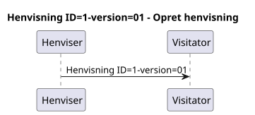 

### Henvisning ID=1-version=02 – Supplerende dokumentation

**Fokusressource:** `DocumentReference`

**Trigger:** Henviser fremsender yderligere materiale.

**Ressourcer:** - `Bundle` - `MessageHeader` - `DocumentReference` - `DiagnosticReport` - `Media`

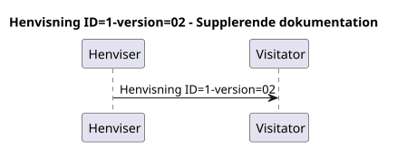 

### Henvisning ID=1-version=03 – Anmodning om supplerende oplysninger

**Fokusressource:** `CommunicationRequest`

**Trigger:** Visitator mangler oplysninger.

**Ressourcer:** - `Bundle` - `MessageHeader` - `CommunicationRequest`

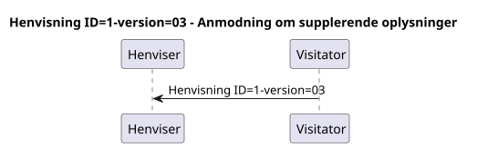 

### Henvisning ID=1-version=04 – Besvarelse af anmodning

**Fokusressource:** `Communication`

**Trigger:** Henviser besvarer anmodning.

**Ressourcer:** - `Bundle` - `MessageHeader` - `Communication`

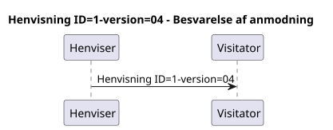 

### Henvisning ID=1-version=05 – Accept af henvisning

**Fokusressource:** `Task`

**Trigger:** Visitator accepterer henvisning.

**Ressourcer:** - `Bundle` - `MessageHeader` - `Task`

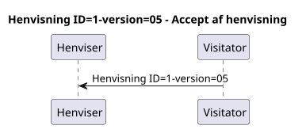 

### Henvisning ID=1-version=06 – Booking gennemført

**Fokusressource:** `Appointment`

**Trigger:** Tid er booket.

**Ressourcer:** - `Bundle` - `MessageHeader` - `Appointment`

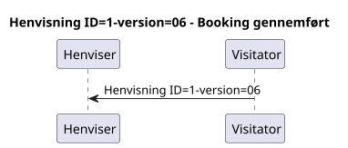 

### Henvisning ID=1-version=07 – Afvisning

**Fokusressource:** `Task`

**Trigger:** Henvisningen afvises.

**Ressourcer:** - `Bundle` - `MessageHeader` - `Task`

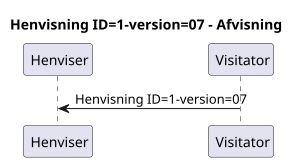 

### Henvisning ID=1-version=08 – Videresendelse

**Fokusressource:** `ServiceRequest`

**Trigger:** Henvisning videresendes.

**Ressourcer:** - `Bundle` - `MessageHeader` - `ServiceRequest`

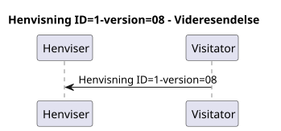 

### Henvisning ID=1-version=09 – Statusopdatering

**Fokusressource:** `Task`

**Trigger:** Status ændres.

**Ressourcer:** - `Bundle` - `MessageHeader` - `Task`

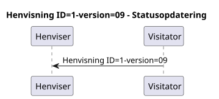 

### Henvisning ID=1-version=10 – Faglig dialog

**Fokusressource:** `Communication`

**Trigger:** Behov for dialog.

**Ressourcer:** - `Bundle` - `MessageHeader` - `Communication`

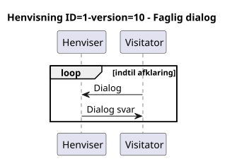 

### Henvisning ID=1-version=11 – Alternativ visitation

**Fokusressource:** `Communication`

**Trigger:** Forslag om alternativ visitation.

**Ressourcer:** - `Bundle` - `MessageHeader` - `Communication`

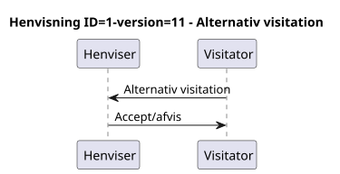 

### Henvisning ID=1-version=12 – Korrektion

**Fokusressource:** `ServiceRequest`

**Trigger:** Korrigering af henvisning.

**Ressourcer:** - `Bundle` - `MessageHeader` - `ServiceRequest`

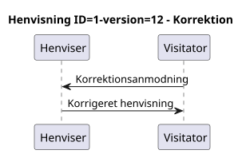

